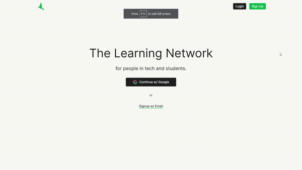

<a name="readme-top"></a>

<!-- TABLE OF CONTENTS -->
<details>
  <summary>Table of Contents</summary>
  <ol>
    <li>
      <a href="#about-the-project">About The Project</a>
      <ul>
        <li><a href="#built-with">Built With</a></li>
      </ul>
    </li>
    <li>
      <a href="#getting-started">Getting Started</a>
      <ul>
        <li><a href="#prerequisites">Prerequisites</a></li>
        <li><a href="#installation">Installation</a></li>
      </ul>
    </li>
    <li><a href="#usage">Usage</a></li>
    <li><a href="#contributing">Contributing</a></li>
    <li><a href="#journey">Journey</a></li>
    <li><a href="#contact">Contact</a></li>
    <li><a href="#acknowledgments">Acknowledgments</a></li>
  </ol>
</details>

## Project demo



### Built With

React, Tailwind and Firebase

<p align="right">(<a href="#readme-top">back to top</a>)</p>

<!-- GETTING STARTED -->

## Getting Started

This is an example of how you may give instructions on setting up your project locally.
To get a local copy up and running follow these simple example steps.

### Prerequisites

- Node: [Install Node](https://nodejs.org/en/download/)
- System Dependencies: npm (comes packaged with Node)

### Code formatter

- Install prettier extension for your IDE (i.e., [Prettier Formatter for Visual Studio Code](https://marketplace.visualstudio.com/items?itemName=esbenp.prettier-vscode)). Your code will be auto fomatted on save.

### Installation

- start react client

```
cd client
npm i
npm start
```

User can navigate at http://localhost:3000

<p align="right">(<a href="#readme-top">back to top</a>)</p>

<!-- USAGE EXAMPLES -->

## Usage

Will update soon...

<p align="right">(<a href="#readme-top">back to top</a>)</p>

<!-- CONTRIBUTING -->

## Contributing

Contributions are what make the open source community such an amazing place to learn, inspire, and create. Any contributions you make are **greatly appreciated**.

If you have a suggestion that would make this better, please fork the repo and create a pull request. You can also simply open an issue with the tag "enhancement".
Don't forget to give the project a star! Thanks again!

Check out [Contributing.md](./Contributing.md)

<p align="right">(<a href="#readme-top">back to top</a>)</p>

<!-- JOURNEY -->

## Journey

[Documentation](https://chrome-mustang-767.notion.site/bb8d6a596b2f422f911493ebd9668863?v=d926459033174a80b502fd3c078a6a55)

<p align="right">(<a href="#readme-top">back to top</a>)</p>
<!-- CONTACT -->

## Contact

Suhas Khobragade - [@suhaasya](https://twitter.com/suhaasya) - suhaskhobragade19@gmail.com <br />
Github Link: [https://github.com/suhaasya](https://github.com/suhaasya)

<p align="right">(<a href="#readme-top">back to top</a>)</p>

<!-- ACKNOWLEDGMENTS -->

## Acknowledgments

Will update soon...

<p align="right">(<a href="#readme-top">back to top</a>)</p>
